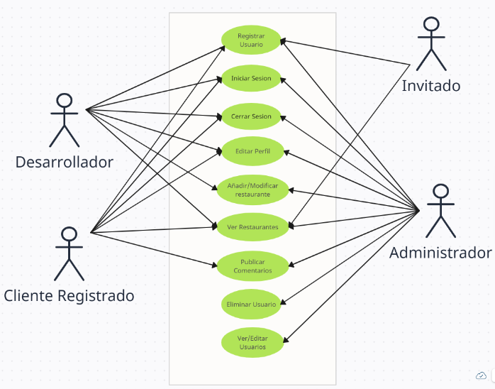

# Definiendo el proyecto 'Vanilla Games'

Vanilla Games S.L. es una empresa de desarrollo de minijuegos para navegadores web, creados con vanillaJS, es decir, desarrollados exclusivamente con Javascript como lenguaje de programación (sin frameworks)

En esta empresa trabajan 10 desarrolladores y, habitualmente, suelen tener a tres alumnos/as en prácticas, de los cuales, al menos uno, tendrá muchas posibilidades de formar parte del equipo de desarrollo al acabar su etapa de formación.

## Casos de uso para la V1.0 - Definición básica​
- Registrar usuario: Un usuario puede registrarse en la plataforma proporcionando su nombre, apellidos, email y contraseña.
- Recuperar contraseña: Un usuario registrado puede solicitar la recuperación de su contraseña en caso de que la haya olvidado. Para ello, se le enviará un correo electrónico con las instrucciones para restablecer su contraseña.
- Iniciar sesión: Un usuario registrado puede iniciar sesión en la plataforma proporcionando su email y contraseña.
- Cerrar sesión: Un usuario puede cerrar su sesión en la plataforma en cualquier momento.
- Editar perfil: Un usuario registrado puede editar su perfil, actualizando su nombre, apellidos, email o contraseña.
- Ver proyectos: Un usuario registrado puede ver un listado de proyectos publicados por los desarrolladores.
- Publicar proyecto: Un usuario con el perfil de desarrollador puede publicar un proyecto proporcionando información como nombre, descripción, imagen representativa, enlaces a servidor de pruebas y repositorio de código, estado del proyecto, etc.
- Editar proyecto: Un usuario con el perfil de desarrollador puede editar un proyecto que haya publicado previamente, actualizando la información del proyecto.
- Eliminar proyecto: Un usuario con el perfil de desarrollador puede eliminar un proyecto que haya publicado previamente.
- Ver/Editar usuarios: Un adminsrador puede ver una tabla con todos los usuarios que hay registrados y editar la información, incluido el ROL de usuario.
- Eliminar usuario: Un administrador puede eliminar cualquier usuario registrado en la plataforma.

## Diagrma de casos de uso para la versión 1.0

## Diseño de Bocetos
### Home y menús usuarios

Hemos didivido la interficie en 3 zonas, el encabezado (header), el cuerpo principal (main) y el pie de página (footer).

*En el header vamos a alojar una barra superior fija con: el logo y nombre de la web (que hará las veces de link a la página principal), un menú central genérico (para acceder a páginas públicas), un menú central específico (que será diferente en función del rol de usuario logueado), y un icono (avatar) que permitirá ver la imagen del usuario logueado y que hará de botón para desplegar otro menú, el menú de usuario (que tendrá diferentes items dependiendo de si la sesió está abierta o no y del tipo de rol que tenga el usuario logueado).
*El cuerpo (main) albergará el contenido de las páginas. Será la sección que vaya cambiando dependiendo de la página que carguemos. En la página home simplemente aparece una imagen de fondo y el nombre de la web.
*El header será meramente informativo.
